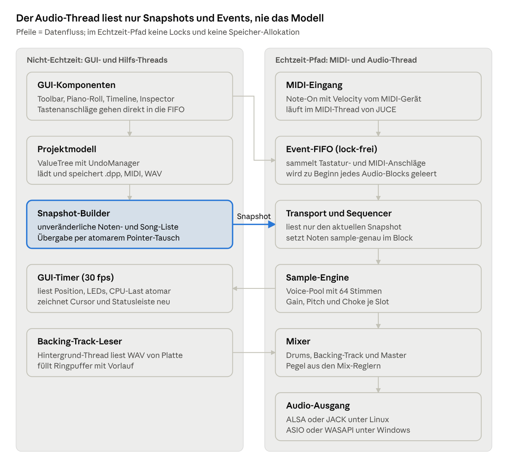
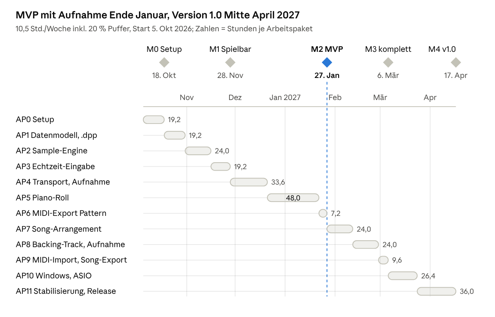

# Pflichtenheft: Drum Programmer v1.0

Stand: 03.10.2026 · Alex

Drum Programmer v1.0 wird als JUCE/C++-Standalone für Linux und Windows in 12 Arbeitspaketen mit rund 242 Stunden (290 Stunden inkl. 20 % Puffer) umgesetzt. Bei 10,5 Stunden pro Woche und Start am 5.10.2026 ist der MVP mit Aufnahme-Funktion etwa am 27.1.2027 und die Version 1.0 etwa Mitte April 2027 fertig. Grundlage sind das Lastenheft (Stand 30.09.2026) und der GUI-Entwurf v0.1 (dunkles und helles Theme).

## 1 Zielbestimmung

Drum Programmer ist eine Standalone-Desktop-Anwendung, mit der Schlagzeug-Patterns live über Computertastatur oder MIDI-Hardware eingespielt, im Piano-Roll bearbeitet und zu Songs verkettet werden. Prioritäten: **Muss (MVP)** = Teil des ersten Meilensteins M2, **Muss (v1.0)** = Pflicht für Release 1.0, **Soll** = geplant für v1.0, darf bei Zeitmangel verschoben werden, **Kann** = spätere Version.

### 1.1 Musskriterien MVP (M2)

- WAV-Samples laden und polyphon abspielen, Standard-Kit nach GM-Drum-Map (Kanal 10)
- Live-Triggern der Samples über Computertastatur und MIDI-Controller
- **Aufnahme ins Pattern (Kernfunktion):** Rec + Play nimmt Live-Anschläge von Tastatur und MIDI-Controller mit Velocity unquantisiert im Loop ins aktive Pattern auf, mit Metronom, Vorzähler und Latenzkompensation
- Transport mit Play, Stop, Loop, Rec, BPM und Taktart
- Piano-Roll mit Zeichnen, Verschieben, Längenänderung, Löschen, Snap-to-Grid (1/4 bis 1/32, Triolen), Alt = frei – auch zum Korrigieren aufgenommener Noten
- Velocity-Lane zur Bearbeitung der Anschlagstärke
- Undo/Redo, insbesondere zum Verwerfen eines Aufnahme-Durchgangs
- Mehrere Patterns in der Pattern-Liste anlegen, umbenennen, löschen
- Projekt speichern und laden (.dpp)
- Export eines Patterns als Standard-MIDI-File
- Audio-Ausgabe über ALSA und JACK unter Linux

### 1.2 Musskriterien Version 1.0

- Song-Arrangement: Timeline mit Pattern-Blöcken per Drag & Drop; Wiederholungen referenzieren dasselbe Pattern
- Backing-Track: WAV-Import, Wellenform-Anzeige, synchrone Wiedergabe am gemeinsamen Transport, getrennte Lautstärke
- **Aufnahme zum Backing-Track:** Live-Eingabe während der Backing-Track läuft direkt in die Song-Timeline aufnehmen
- MIDI-Import (.mid) in ein Pattern, Song-Export als durchgehende MIDI-Datei
- Windows-Build über CI mit ASIO-Ausgabe
- Inspector für Note und Sample-Slot (Datei, MIDI-Note-Override, Taste, Lautstärke)

### 1.3 Sollkriterien

- Choke-Gruppe Hi-Hat: Closed/Pedal Hi-Hat beendet klingende Open Hi-Hat
- Pitch pro Sample-Slot (im GUI-Entwurf vorhanden)
- Helles und dunkles Farbschema (beide Entwürfe)

### 1.4 Kannkriterien (spätere Versionen)

- Quantisierung und Swing als Funktion auf bestehende Noten
- Sample-Formate AIFF und FLAC
- Takes einer Backing-Track-Aufnahme automatisch in wiederkehrende Patterns zerlegen
- Tempo- und Taktartwechsel innerhalb eines Songs
- macOS-Build

### 1.5 Abgrenzungskriterien

- Kein VST/Plugin-Hosting, keine Plugin-Version der Anwendung
- Keine Effekte und kein Mixer über Lautstärke je Slot und die drei Referenz-Regler hinaus
- Kein Cloud-Sync, keine Kollaboration
- Keine automatische Pattern-Generierung

## 2 Produkteinsatz und Produktumgebung

Zielgruppe sind Hobby-Schlagzeuger und Musiker, die Drum-Spuren einspielen und bearbeiten wollen, ohne eine vollständige DAW zu bedienen. Die Anwendung läuft als Einzelplatz-Programm ohne Netzwerkzugriff.

| Bereich | Festlegung |
| --- | --- |
| Betriebssysteme | Linux (primär, Entwicklung auf Linux Mint), Windows 10/11 64 Bit |
| Framework | JUCE 8 (AGPLv3), C++17 oder höher |
| Build | CMake, CLion; CI über GitHub Actions (ubuntu-latest, windows-latest mit MSVC) |
| Audio-Treiber | Linux: ALSA, JACK; Windows: ASIO (Steinberg-SDK unter GPLv3, von CMake geladen, nicht im Repo), WASAPI als Fallback |
| MIDI | Jedes vom Betriebssystem erkannte USB-MIDI-Gerät (Referenz im Entwurf: Alesis Nitro Mesh) |
| Referenz-Hardware | Audio-Interface mit ASIO/JACK-Treiber (Referenz im Entwurf: Focusrite Scarlett 2i2, 48 kHz) |
| Mindest-Auflösung | 1280 × 800 Pixel; Entwurf ausgelegt für 1920 × 1080 |
| Dateiformate | Samples und Backing-Track: WAV (16/24/32-Bit float, Mono/Stereo); MIDI: SMF Typ 0 und 1; Projekt: .dpp |
| Lizenz des Produkts | AGPLv3 (folgt aus JUCE-Open-Source-Lizenz), Quellcode öffentlich |

## 3 Systemarchitektur

Die Anwendung trennt strikt zwischen GUI-Thread und Echtzeit-Pfad: Der Audio-Callback liest nur unveränderliche Snapshots des Modells und eine lock-freie Event-Queue. Damit sind die im Lastenheft (Abschnitt 5) genannten Race Conditions konstruktiv ausgeschlossen.

Pfeile zeigen den Datenfluss. Rückmeldungen an das GUI (Wiedergabe-Position, Trigger-LEDs, CPU-Last) laufen über atomare Variablen, die ein GUI-Timer 30-mal pro Sekunde liest.

| Modul (Quellordner) | Verantwortung |
| --- | --- |
| `model/` | Projekt, Pattern, Note, Song, Kit als ValueTree; Undo; Serialisierung |
| `engine/` | Sequencer, Voice-Pool, Sample-Laden, Backing-Track-Player, Mixer |
| `io/` | .dpp, MIDI-Import/Export, Kit-Dateien |
| `input/` | Tastatur-Mapping, MIDI-Geräte, Event-FIFO |
| `ui/` | Hauptfenster, Piano-Roll, Timeline, Inspector, LookAndFeel |
| `tests/` | Unit- und Offline-Render-Tests |

## 4 Datenmodell und Projektdatei

Alle Zeiten werden intern in absoluten Ticks mit 960 PPQ (Ticks pro Viertel) gespeichert, wie in Reaper (1/16 = 240 Ticks); das Raster ist nur Editier-Hilfe. 960 PPQ löst auch 1/32-Triolen ganzzahlig auf (80 Ticks), passt zu Reaper-Projekten ohne Umrechnung und bleibt MIDI-kompatibel (SMF erlaubt bis 32.767 PPQ). Die Anzeige im GUI rechnet in Takt.Schlag.Tick um.

| Entität | Wichtige Attribute | Bemerkung |
| --- | --- | --- |
| Project | name, bpm, timeSignature, ppq = 960, kit (optional), patterns\[\], song, backingTrack, mix | Wurzelobjekt, wird als .dpp gespeichert; ohne eigenes Kit gilt das Programm-Kit |
| Kit | slots\[\] (16–20 Kernslots nach GM-Map) | Programm-Kit (Einstellung, startet als GM-Default-Kit); ein Projekt kann es als eigenes Kit übernehmen, das dann das Programm-Kit überschreibt |
| SampleSlot | midiNote (Default GM, überschreibbar), name, filePath (relativ zur .dpp), gain, pitch, chokeGroup | Datei-Pfade relativ, damit Projekte portabel sind |
| Pattern | id (UUID), name, color, lengthBars, notes\[\] | eigenständig und wiederverwendbar |
| Note | slotNote, startTick, lengthTicks, velocity (1–127), origin (grid oder live) | origin steuert Farbe: orange = gerastert, violett = frei eingespielt |
| Song | entries\[\] = {patternId, startBar} | Wiederholungen referenzieren dieselbe patternId |
| BackingTrack | filePath, offsetSamples, gain | Wellenform wird zur Laufzeit per AudioThumbnail erzeugt, Cache optional |
| Mix | backingGain, drumsGain, masterGain | die drei Regler „Mix (Referenz)“ |
| Keymap | midiNote → Scancode | Programmeinstellung, nicht Teil der .dpp; hängt an der Tastatur, nicht am Projekt |

**Umsetzung.** Das Modell wird als JUCE `ValueTree` geführt. Das liefert Undo/Redo über `UndoManager`, Change-Listener für das GUI und XML-Serialisierung ohne eigenen Parser. Die .dpp-Datei ist XML mit Versionsattribut (`formatVersion="1"`), damit spätere Formate migriert werden können.

**Audio-Thread.** Der Audio-Thread liest nie direkt aus dem ValueTree. Bei jeder Änderung erzeugt der GUI-Thread einen unveränderlichen Snapshot (sortierte Noten-Liste je Pattern plus Song-Liste) und übergibt ihn per atomarem Pointer-Tausch. Alte Snapshots werden im GUI-Thread freigegeben, nie im Audio-Callback.

## 5 Funktionale Anforderungen

Jede Anforderung hat eine feste ID, auf die sich Arbeitspakete (Kapitel 8) und Tests (Kapitel 10) beziehen. Spalte GUI = Bereichsnummer im GUI-Entwurf v0.1, LH = Abschnitt im Lastenheft.

### 5.1 Projektverwaltung

| ID | Anforderung | Priorität | GUI | LH |
| --- | --- | --- | --- | --- |
| F-PJ-01 | Neues Projekt mit GM-Default-Kit, 120 BPM, 4/4 und einem leeren Pattern (2 Takte) anlegen | Muss (MVP) | Menü Datei | – |
| F-PJ-02 | Projekt als .dpp speichern, „Speichern unter“, Laden; Projektname im Fenstertitel | Muss (MVP) | Titelzeile | – |
| F-PJ-03 | Fehlende Sample-Dateien beim Laden melden und Slot als „kein Sample“ markieren, statt abzubrechen | Muss (MVP) | 5 | – |
| F-PJ-04 | Ungespeicherte Änderungen beim Schließen abfragen | Muss (MVP) | – | – |
| F-PJ-05 | Undo/Redo für alle Editier-Aktionen und Aufnahme-Durchgänge (Strg+Z / Strg+Y) | Muss (MVP) | Menü Bearbeiten | – |

### 5.2 Transport und Clock

| ID | Anforderung | Priorität | GUI | LH |
| --- | --- | --- | --- | --- |
| F-TR-01 | Play, Stop, Zurück-zum-Anfang; Leertaste = Play/Stop | Muss (MVP) | 1 | 3.5 |
| F-TR-02 | Loop-Modus: aktives Pattern bzw. Song-Bereich endlos wiederholen | Muss (MVP) | 1 | 3.3 |
| F-TR-03 | BPM 30–300 mit zwei Nachkommastellen; Taktart Zähler 1–16, Nenner 4/8/16 | Muss (MVP) | 1 | 3.3 |
| F-TR-04 | Positionsanzeige Takt.Schlag.Tick, während Wiedergabe laufend aktualisiert (≥ 30 fps) | Muss (MVP) | 1 | – |
| F-TR-05 | Modus-Umschalter Pattern/Song: im Pattern-Modus spielt das gewählte Pattern, im Song-Modus die Timeline | Muss (v1.0) | 1 | 3.4 |
| F-TR-06 | Sample-genaue Wiedergabe: Noten werden auf das exakte Sample im Audio-Block gelegt, nicht auf Blockgrenzen | Muss (MVP) | – | 4 |
| F-TR-07 | Rec-Taste (Kurzbefehl Strg+R) schaltet Aufnahme scharf; Play startet die Aufnahme nach dem Vorzähler; Rec leuchtet rot während der Aufnahme | Muss (MVP) | 1 | 3.2 |
| F-TR-08 | Metronom an/aus mit eigenem Pegel, getrennt für Wiedergabe und Aufnahme schaltbar | Muss (MVP) | 1 | – |
| F-TR-09 | Vorzähler vor der Aufnahme: 0, 1 oder 2 Takte | Muss (MVP) | 1 | – |

### 5.3 Sample-Engine und Drum-Kit

| ID | Anforderung | Priorität | GUI | LH |
| --- | --- | --- | --- | --- |
| F-SE-01 | WAV laden über `AudioFormatManager`; Formatwahl so gekapselt, dass AIFF/FLAC ohne Engine-Umbau ergänzt werden | Muss (MVP) | 5, 10 | 3.1 |
| F-SE-02 | Samples vollständig in den RAM laden; Resampling auf die Geräte-Samplerate beim Laden | Muss (MVP) | – | 3.1 |
| F-SE-03 | Polyphonie: mindestens 64 gleichzeitige Stimmen; bei Überlauf wird die älteste Stimme kurz ausgeblendet | Muss (MVP) | – | 3.1 |
| F-SE-04 | Default-Kit mit den GM-Noten 35–59; im Kit-Panel sichtbar sind die belegten Kernslots, weitere per Aufklappen | Muss (MVP) | 5 | 3.1 |
| F-SE-05 | MIDI-Note je Slot überschreibbar; Anzeige „(GM-Default)“ solange nicht geändert | Muss (v1.0) | 10 | 3.1 |
| F-SE-06 | Lautstärke je Slot; Velocity skaliert den Pegel linear in dB-Kurve | Muss (MVP) | 10 | 3.1 |
| F-SE-07 | Pitch je Slot ±12 Halbtöne (per Abspielgeschwindigkeit) | Soll | 10 | – |
| F-SE-08 | Choke-Gruppe: Closed (42) und Pedal Hi-Hat (44) stoppen Open Hi-Hat (46) mit 5 ms Fade | Soll | – | – |
| F-SE-09 | Trigger-LED je Slot leuchtet bei jedem Anschlag (Live und Wiedergabe) | Muss (MVP) | 5 | – |
| F-SE-10 | Vorhören-Taste im Inspector spielt das Sample mit Velocity 100 | Muss (MVP) | 10 | – |

### 5.4 Echtzeit-Eingabe

| ID | Anforderung | Priorität | GUI | LH |
| --- | --- | --- | --- | --- |
| F-IN-01 | Computertastatur triggert Slots nach Tasten-Mapping (Default siehe 6.3); feste Velocity 100, Shift = 127 | Muss (MVP) | 3, 5, 8 | 3.2 |
| F-IN-02 | Tasten-Mapping im GUI einstellbar: Taste je Slot im Inspector und Dialog „Tastatur-Mapping“ (Menü Audio) mit Liste aller Slots, Lernmodus (Feld anklicken, Taste drücken) und „Standard wiederherstellen“; Doppelbelegungen werden gemeldet; Mapping wird als Programmeinstellung gespeichert und gilt für alle Projekte | Muss (MVP) | 10 | 3.2 |
| F-IN-03 | MIDI-Eingang: Auswahl des Geräts in den Audio/MIDI-Einstellungen; Note-On mit Velocity triggert den Slot mit passender MIDI-Note | Muss (MVP) | 3, 11 | 3.2 |
| F-IN-04 | Note-On mit Velocity 0 wird als Note-Off behandelt; Note-Off beendet One-Shot-Samples nicht | Muss (MVP) | – | 3.2 |
| F-IN-05 | Eingangs-LEDs „MIDI In“ und „Tastatur“ blinken bei Eingang | Muss (MVP) | 3 | – |
| F-IN-06 | Tastatur-Trigger nur wenn kein Textfeld den Fokus hat | Muss (MVP) | – | – |
| F-IN-07 | Aufnahme ins Pattern: bei aktivem Rec werden Anschläge von Tastatur und MIDI mit Velocity unquantisiert als violette Noten (origin = live) ins aktive Pattern geschrieben; im Loop ergänzt jeder Durchgang das Pattern | Muss (MVP) | 1, 8 | 3.2, 3.3 |
| F-IN-08 | Latenzkompensation: Noten werden an der Position gespeichert, an der der Anschlag zur gehörten Wiedergabe gespielt wurde (Ausgangslatenz abgezogen); zusätzlicher Versatz in den Einstellungen ±50 ms feinjustierbar | Muss (MVP) | – | 4 |
| F-IN-09 | Aufnahme-Modi Overdub (Standard) und Ersetzen; jeder Durchgang von Start bis Stop ist ein Undo-Schritt | Muss (MVP) | 1 | – |
| F-IN-10 | Aufgenommene Noten erscheinen sofort im Piano-Roll und sind ab dem nächsten Loop-Durchgang hörbar; Noten, die über das Pattern-Ende hinausgehen, werden an den Anfang gefaltet | Muss (MVP) | 8 | – |

### 5.5 Piano-Roll und Velocity-Lane

| ID | Anforderung | Priorität | GUI | LH |
| --- | --- | --- | --- | --- |
| F-PR-01 | Zeilen = Slots des Kits (MIDI-Note, Name, Taste), sortiert nach MIDI-Note absteigend | Muss (MVP) | 8 | 3.3 |
| F-PR-02 | Werkzeuge Zeichnen, Auswahl, Löschen über Toolbar und Strg+1/2/3 (Buchstabentasten sind für Drum-Trigger belegt) | Muss (MVP) | 1 | 3.3 |
| F-PR-03 | Note setzen per Klick, Länge per Ziehen am rechten Rand, Verschieben per Drag (auch zeilenübergreifend), Löschen per Rechtsklick oder Entf | Muss (MVP) | 8 | 3.3 |
| F-PR-04 | Snap an/aus, Raster 1/4, 1/8, 1/16, 1/32 und Triolen-Varianten; Alt hält Snap temporär aus | Muss (MVP) | 2 | 3.3 |
| F-PR-05 | Rechteck-Auswahl, Mehrfachauswahl mit Strg, Kopieren/Einfügen/Duplizieren | Muss (MVP) | 8 | 3.3 |
| F-PR-06 | Tooltip mit Zielposition beim Verschieben (z. B. „→ 002.1.15“), Geisterrahmen am Ziel | Muss (MVP) | 8 | – |
| F-PR-07 | Farbkodierung: orange = gerastert, violett = frei eingespielt; ausgewählte Noten mit hellem Rahmen | Muss (MVP) | 8 | 3.3 |
| F-PR-08 | Horizontaler/vertikaler Zoom und Scroll; Taktlinien kräftiger als Schlaglinien | Muss (MVP) | 8 | – |
| F-PR-09 | Pattern-Länge 1–64 Takte einstellbar | Muss (MVP) | 4, 8 | 3.3 |
| F-PR-10 | Velocity-Lane unter dem Piano-Roll; zeigt die Noten der gewählten Zeile; Wert per Ziehen ändern, Strich-Ziehen über mehrere Noten | Muss (MVP) | 9 | 3.3 |
| F-PR-11 | Wiedergabe-Cursor (grüne Linie) läuft synchron in Piano-Roll und Song-Timeline | Muss (MVP) | 6, 8 | – |

### 5.6 Pattern-Liste und Song-Arrangement

| ID | Anforderung | Priorität | GUI | LH |
| --- | --- | --- | --- | --- |
| F-SO-01 | Pattern-Liste: anlegen (+), umbenennen, Farbe wählen, duplizieren, löschen; Klick öffnet das Pattern im Piano-Roll | Muss (MVP) | 4 | 3.4 |
| F-SO-02 | Song-Timeline mit Taktlineal; Pattern per Drag & Drop aus der Liste auf die Drums-Spur ziehen | Muss (v1.0) | 6 | 3.4 |
| F-SO-03 | Blöcke verschieben (taktweise einrastend), löschen, per Alt-Drag duplizieren | Muss (v1.0) | 6 | 3.4 |
| F-SO-04 | Mehrfach platzierte Blöcke referenzieren dasselbe Pattern; Änderung im Piano-Roll wirkt auf alle Vorkommen | Muss (v1.0) | 6 | 3.4 |
| F-SO-05 | Löschen eines Patterns, das im Song verwendet wird, erfordert Bestätigung und entfernt alle Blöcke | Muss (v1.0) | 4, 6 | – |
| F-SO-06 | Doppelklick auf Block öffnet dessen Pattern im Piano-Roll | Muss (v1.0) | 6 | – |
| F-SO-07 | Zoom der Timeline (– / +) | Muss (v1.0) | 6 | – |

### 5.7 Backing-Track

| ID | Anforderung | Priorität | GUI | LH |
| --- | --- | --- | --- | --- |
| F-BT-01 | WAV-Datei als Backing-Track importieren (eine Spur pro Projekt) | Muss (v1.0) | 7 | 3.5 |
| F-BT-02 | Streaming von der Platte (kein vollständiges Laden), Resampling auf Geräte-Samplerate | Muss (v1.0) | – | 3.5 |
| F-BT-03 | Wiedergabe über denselben Transport wie die Drums, kein Drift über 10 Minuten | Muss (v1.0) | 7 | 3.5 |
| F-BT-04 | Wellenform-Anzeige (`AudioThumbnail`) im Takt-Raster der Timeline | Muss (v1.0) | 7 | 3.5 |
| F-BT-05 | Versatz (Offset) einstellbar, damit Takt 1 des Songs auf Takt 1 der Timeline liegt | Muss (v1.0) | 7 | – |
| F-BT-06 | Gain Backing-Track, Drums (live) und Master getrennt | Muss (v1.0) | 10 | 3.5 |
| F-BT-07 | Aufnahme zum Backing-Track: Rec + Play im Song-Modus nimmt die Live-Eingabe auf, während der Backing-Track synchron läuft; Start an beliebiger Song-Position, Vorzähler und Latenzkompensation wie F-IN-08 | Muss (v1.0) | 1, 6, 7 | 3.5 (ersetzt Out of Scope in 8) |
| F-BT-08 | Ein Durchgang wird als neues Pattern „Take n“ über den aufgenommenen Takten (auf ganze Takte gerundet) als Block auf die Drums-Spur gelegt; bestehende Patterns werden nicht verändert; ein Take ist ein Undo-Schritt | Muss (v1.0) | 4, 6 | 3.4 |
| F-BT-09 | Der Backing-Track selbst wird nicht aufgenommen oder verändert; aufgenommen werden nur Drum-Noten | Muss (v1.0) | – | 3.5 |

### 5.8 MIDI-Import und -Export

| ID | Anforderung | Priorität | GUI | LH |
| --- | --- | --- | --- | --- |
| F-MI-01 | Export des aktiven Patterns als SMF Typ 0, Kanal 10, mit Tempo und Taktart | Muss (MVP) | 3 | 3.6 |
| F-MI-02 | Song-Export: Timeline zu einer durchgehenden MIDI-Datei rendern | Muss (v1.0) | 3 | 3.6 |
| F-MI-03 | Import einer .mid-Datei als neues Pattern; PPQ-Umrechnung, Noten ohne passenden Slot werden gemeldet | Muss (v1.0) | 3 | 3.6 |
| F-MI-04 | Importierte Noten erhalten origin = live (violett), da sie nicht gerastert sind | Muss (v1.0) | 8 | 3.3 |
| F-MI-05 | Export-Dialog: Wahl Pattern oder Song | Muss (v1.0) | 3 | 3.6 |

### 5.9 Audio-Ausgabe und Einstellungen

| ID | Anforderung | Priorität | GUI | LH |
| --- | --- | --- | --- | --- |
| F-AO-01 | Einstellungsdialog (Zahnrad) auf Basis `AudioDeviceSelectorComponent`: Treiber, Gerät, Samplerate, Buffer-Größe, MIDI-Eingang | Muss (MVP) | 3, 11 | 3.7 |
| F-AO-02 | Linux: ALSA und JACK | Muss (MVP) | 11 | 3.7 |
| F-AO-03 | Windows: ASIO, WASAPI als Fallback | Muss (v1.0) | 11 | 3.7 |
| F-AO-04 | Letzte Geräte-Einstellung wird gespeichert und beim Start wiederhergestellt | Muss (MVP) | – | – |
| F-AO-05 | Statusleiste: Treiber, Gerät, Samplerate, Buffer, berechnete Latenz, CPU-Last, MIDI-Gerät | Muss (MVP) | 11 | 4 |

## 6 Benutzeroberfläche

Das Hauptfenster folgt dem GUI-Entwurf v0.1: ein einziges Fenster mit festen Bereichen, keine schwebenden Fenster außer Dialogen. Beide Entwürfe (dunkel, hell) zeigen dasselbe Layout; das Farbschema wird über ein zentrales `LookAndFeel` mit Farb-Tokens umgesetzt.

### 6.1 Bereiche des Hauptfensters

| Nr. | Bereich | Position | Inhalt und Verhalten | Anforderungen |
| --- | --- | --- | --- | --- |
| 1 | Transport und Toolbar | oben, volle Breite | Zurück, Play, Stop, Loop, Rec, Metronom, Vorzähler, Position, BPM, Takt, Modus Pattern/Song | F-TR-01 bis 09 |
| 2 | Snap und Werkzeuge | Toolbar Mitte | Snap-Toggle, Raster-Dropdown, Hinweis „Alt = frei“, Zeichnen/Auswahl/Löschen | F-PR-02, F-PR-04 |
| 3 | MIDI und Einstellungen | Toolbar rechts | LEDs MIDI In und Tastatur, MIDI Import, MIDI Export, Zahnrad | F-IN-05, F-MI-01 bis 05, F-AO-01 |
| 4 | Pattern-Liste | links oben, ca. 250 px | Farbpunkt, Name, Länge in Takten, + zum Anlegen, Kontextmenü | F-SO-01 |
| 5 | Drum-Kit | links unten, scrollbar | MIDI-Note, Instrument, Dateiname oder „kein Sample“, Trigger-LED; Auswahl füllt Inspector | F-SE-04, F-SE-09 |
| 6 | Song-Timeline | Mitte oben | Taktlineal, Drums-Spur mit farbigen Pattern-Blöcken, Zoom | F-SO-02 bis 07 |
| 7 | Backing-Track-Spur | über der Drums-Spur | Dateiname, Wellenform im Takt-Raster | F-BT-01 bis 05 |
| 8 | Piano-Roll | Mitte, größter Bereich | Kopfzeile mit Pattern-Name, Länge, Takt, Raster und Legende; Zeilen je Slot mit Tasten-Badge | F-PR-01 bis 11 |
| 9 | Velocity-Lane | unter Piano-Roll, ca. 110 px | Balken je Note der gewählten Zeile | F-PR-10 |
| 10 | Inspector | rechts, ca. 290 px | Ausgewählte Note (Instrument, Position, Länge, Velocity), Sample-Slot (Datei, Mini-Wellenform, MIDI-Note, Taste, Lautstärke, Pitch, Laden, Vorhören), Mix (Backing, Drums, Master) | F-SE-05 bis 10, F-BT-06 |
| 11 | Statusleiste | unten, volle Breite | Treiber, Gerät, Samplerate, Buffer, Latenz, CPU, MIDI-Gerät; rechts Snap und Anzahl ausgewählter Noten | F-AO-05 |

### 6.2 Menüleiste

| Menü | Einträge |
| --- | --- |
| Datei | Neu, Öffnen, Zuletzt geöffnet, Speichern, Speichern unter, Beenden |
| Bearbeiten | Rückgängig, Wiederholen, Ausschneiden, Kopieren, Einfügen, Duplizieren, Alles auswählen |
| Pattern | Neu, Duplizieren, Umbenennen, Länge, Löschen |
| Song | Pattern einfügen, Block löschen, Song leeren |
| MIDI | Import, Export Pattern, Export Song, Eingangsgerät |
| Audio | Einstellungen, Backing-Track laden/entfernen, Kit laden/speichern |
| Hilfe | Tastaturkürzel, Über |

### 6.3 Default-Tastatur-Mapping (aus GUI-Entwurf)

| Taste | Slot | Taste | Slot |
| --- | --- | --- | --- |
| A | 36 Bass Drum 1 | T | 48 Hi-Mid Tom |
| X | 37 Side Stick | 0 | 49 Crash Cymbal 1 |
| S | 38 Acoustic Snare | Z | 50 High Tom |
| D | 39 Hand Clap | I | 51 Ride Cymbal 1 |
| F | 41 Low Floor Tom | U | 53 Ride Bell |
| W | 42 Closed Hi-Hat | 7 | 54 Tambourine |
| Q | 44 Pedal Hi-Hat | 8 | 56 Cowbell |
| R | 45 Low Tom | 9 | 57 Crash Cymbal 2 |
| E | 46 Open Hi-Hat |  |  |

Das Mapping wird über physische Tastenpositionen (Scancodes) umgesetzt, nicht über Zeichen, und ist im GUI frei einstellbar (F-IN-02). Sonst liegt „Z“ auf deutscher QWERTZ-Tastatur an anderer Stelle als im Entwurf gedacht (siehe K5).

### 6.4 Bedienprinzipien

- Jede Aktion ist per Maus erreichbar; Tastenkürzel nur mit Strg, damit Buchstaben frei für Drum-Trigger bleiben (Ausnahmen: Leertaste, Entf, Alt beim Ziehen)
- Änderungen im Inspector wirken sofort, ohne „Übernehmen“-Taste
- Fenstergröße frei; Piano-Roll und Timeline wachsen, Seitenleisten behalten ihre Breite

## 7 Qualitätsanforderungen

Die Latenz ist das wichtigste Qualitätsziel: ein Anschlag muss sich beim Einspielen direkt anfühlen. Alle Werte gelten für die Referenz-Hardware (Kapitel 2) im Normalbetrieb.

| ID | Merkmal | Messbares Kriterium | Priorität |
| --- | --- | --- | --- |
| Q-01 | Ausgangslatenz | Buffer 128 Samples bei 48 kHz (2,7 ms je Puffer) läuft ohne Dropouts; Anschlag bis Ton ≤ 6 ms, Ziel 5 ms | Muss (MVP) |
| Q-02 | Buffer einstellbar | 32 bis 2048 Samples wählbar; Statusleiste zeigt die resultierende Latenz | Muss (MVP) |
| Q-03 | Dropout-Freiheit | 30 Minuten Wiedergabe mit Song, Backing-Track und Live-Eingabe ohne hörbaren Aussetzer bei Buffer 128 | Muss (v1.0) |
| Q-04 | Echtzeit-Sicherheit | Im Audio-Callback keine Speicher-Allokation, keine Locks, kein Datei-Zugriff, kein Logging | Muss (MVP) |
| Q-05 | CPU-Last | ≤ 15 % auf einem Kern bei 16 gleichzeitigen Stimmen plus Backing-Track | Muss (v1.0) |
| Q-06 | Timing-Genauigkeit | Noten liegen sample-genau; Abweichung Backing-Track zu Drums nach 10 Minuten = 0 Samples | Muss (v1.0) |
| Q-07 | GUI-Reaktion | Piano-Roll bleibt bei 2.000 Noten flüssig (≥ 30 fps beim Scrollen) | Muss (v1.0) |
| Q-08 | Startzeit | Programmstart bis bedienbar ≤ 3 s ohne Projekt | Soll |
| Q-09 | Robustheit | Absturz- und Datenverlustfreiheit bei fehlenden Dateien, abgezogenem MIDI-Gerät oder Wechsel des Audio-Geräts | Muss (v1.0) |
| Q-10 | Datensicherheit | Speichern schreibt erst in eine temporäre Datei und benennt dann um; automatische Sicherung alle 5 Minuten | Soll |
| Q-11 | Bedienbarkeit | Ein Einsteiger legt ohne Anleitung ein 2-Takt-Pattern an und spielt es ab (≤ 5 Minuten) | Muss (v1.0) |
| Q-12 | Lizenz | Nur Open-Source-Bibliotheken; ASIO-SDK (GPLv3 seit 10/2025) wird beim Bauen geladen, nicht im Repository; Lizenzhinweise im Über-Dialog | Muss (MVP) |
| Q-13 | Portabilität | Gleicher Quellcode für Linux und Windows; plattformspezifischer Code nur in klar getrennten Dateien | Muss (MVP) |
| Q-14 | Wartbarkeit | Modul-Struktur nach Kapitel 3; Entwicklungsvorgaben E-01 bis E-09 (TDD, 100 % Abdeckung, Clean Code, Constructor Injection) | Muss (MVP) |

### Entwicklungsvorgaben

Der Code wird testgetrieben, mit 100 % Unit-Test-Abdeckung, nach Clean-Code-Regeln und mit Inversion of Control über Constructor Dependency Injection entwickelt. Wo die Leistungskriterien Q-01 bis Q-06 dem entgegenstehen, also im Echtzeit-Pfad, gehen sie vor: Dort wird die Abhängigkeit weiterhin im Konstruktor injiziert, aber statisch zur Compile-Zeit aufgelöst (E-07).

| ID | Vorgabe | Umsetzung | Nachweis |
| --- | --- | --- | --- |
| E-01 | Testgetriebene Entwicklung (TDD) | Red-Green-Refactor: erst ein fehlschlagender Test, dann der minimale Code, dann Refactoring. Jeder Test nennt die Anforderungs-ID im Namen, z. B. `FIN07_RecordsLiveHitIntoActivePattern` | Test-Commit vor Implementierungs-Commit; CI läuft bei jedem Push |
| E-02 | 100 % Unit-Test-Abdeckung | 100 % Zeilen- und Branch-Abdeckung für `model/`, `engine/`, `io/`, `input/` und die Logik in `ui/` (Presenter/ViewModels), gemessen mit llvm-cov bzw. gcovr | CI-Gate: Build schlägt unter 100 % fehl; Coverage-Bericht als CI-Artefakt |
| E-03 | Humble Object für nicht testbaren Code | JUCE-Zeichenroutinen, Treiber-Callbacks und `main` bleiben so dünn, dass sie keine Logik enthalten. Jede Ausnahme von E-02 steht mit Begründung in `coverage-exclusions.txt` | Prüfung der Ausnahmeliste je Meilenstein; Ziel unter 3 % der Codezeilen |
| E-04 | Inversion of Control, Constructor Injection | Klassen erzeugen ihre Abhängigkeiten nicht selbst, sondern erhalten sie über den Konstruktor. Keine Singletons, kein globaler Zustand, kein Service-Locator | Review-Checkliste; clang-tidy-Regeln |
| E-05 | Composition Root | Der Objektgraph wird an genau einer Stelle beim Programmstart verdrahtet, manuell und ohne DI-Container | eine Datei `AppComposition.cpp` |
| E-06 | Abstraktionen nach außen | Audio-Treiber, MIDI, Dateisystem und Uhr liegen hinter Interfaces (`IAudioDevice`, `IMidiInput`, `IFileSystem`, `IClock`, `ISampleLoader`) | Unit-Tests laufen ohne Audio-Gerät mit Test-Doubles (GoogleMock) |
| E-07 | DI im Echtzeit-Pfad | Im Audio-Callback keine virtuellen Aufrufe pro Sample. Abhängigkeiten werden dort als Template-Parameter (statische Polymorphie) injiziert oder nur einmal pro Audio-Block aufgerufen; Tests setzen eigene Typen ein | Benchmark-Test: Callback-Laufzeit erfüllt Q-05; keine Allokation (Q-04) |
| E-08 | Clean Code | Sprechende Namen, eine Verantwortung pro Klasse (SOLID), Funktionen in der Regel unter 30 Zeilen, keine Duplikate, kein auskommentierter Code; Kommentare erklären das Warum | clang-format (`.clang-format`), clang-tidy und Warnungen als Fehler (`-Wall -Wextra -Werror` bzw. `/W4 /WX`) in CI |
| E-09 | Werkzeuge | GoogleTest und GoogleMock (BSD-Lizenz) über CTest in CMake und CLion; Sanitizer-Builds (Address, Undefined, Thread) in CI | CI-Matrix |

**Aufwand.** TDD und volle Abdeckung kosten erfahrungsgemäß 15–35 % mehr Implementierungszeit und sparen dafür Fehlersuche, vor allem in AP11. AP0 wächst um 4 Std. für die Test-Infrastruktur; den restlichen Mehraufwand fängt der 20-%-Puffer teilweise auf. Nach M1 wird die tatsächliche Geschwindigkeit gemessen und der Zeitplan neu geschätzt (siehe Kapitel 11).

## 8 Projektplanung: Arbeitspakete

Die Umsetzung ist in 12 Arbeitspakete mit zusammen 242 Stunden gegliedert; mit 20 % Puffer für C++/JUCE-Einarbeitung und Threading-Fehlersuche sind 290 Stunden geplant. Grundlage: 10,5 Stunden pro Woche (3 Std. an 3–4 Tagen), Start am 5.10.2026. Gegenüber der Lastenheft-Roadmap kommen AP1 (Datenmodell, Projektdatei, Undo) und AP4 (Transport, Sequencer) als eigene Pakete hinzu; der Windows-CI-Build wird nach vorne in AP0 gezogen.

| AP | Inhalt | Aufgaben | Anforderungen | Std. | Std. inkl. Puffer |
| --- | --- | --- | --- | --- | --- |
| AP0 | Setup | Git-Repo, CMake mit JUCE als Submodule, CLion-Projekt, Audio-Callback mit Testton, Einstellungsdialog, CI für Linux und Windows (nur Build); Test-Infrastruktur: GoogleTest/GoogleMock, Coverage-Gate, clang-format/clang-tidy, Sanitizer-Builds, Composition Root | F-AO-01, F-AO-02, F-AO-04, Q-12, Q-13, E-01 bis E-09 | 16 | 19,2 |
| AP1 | Datenmodell und Projektdatei | ValueTree-Modell, Snapshot-Übergabe an Audio-Thread, .dpp speichern/laden, UndoManager, Unit-Tests | F-PJ-01 bis 05, Q-14 | 16 | 19,2 |
| AP2 | Sample-Engine | WAV-Laden, Resampling, Voice-Pool (64 Stimmen), GM-Default-Kit, Gain, Choke, Pitch, Vorhören | F-SE-01 bis 10, Q-04 | 20 | 24,0 |
| AP3 | Echtzeit-Eingabe | Tastatur-Mapping per Scancode, Mapping-Dialog mit Lernmodus, MIDI-Gerät, lock-freie Event-Queue GUI → Audio, LEDs, Latenzmessung | F-IN-01 bis 06, Q-01, Q-02 | 16 | 19,2 |
| AP4 | Transport, Sequencer, Aufnahme | Play/Stop/Loop, BPM, Taktart, sample-genaue Noten-Ausgabe aus Snapshot, Positionsanzeige, Metronom, Vorzähler; Aufnahme mit Zeitstempel je Anschlag, Latenzkompensation, Overdub/Ersetzen, Loop-Faltung, Rückschreiben ins Modell als Undo-Schritt | F-TR-01 bis 09, F-IN-07 bis 10 | 28 | 33,6 |
| AP5 | Piano-Roll und Pattern-Liste | Raster-Rendering, Zoom/Scroll, Werkzeuge, Drag/Resize, Snap und Triolen, Auswahl, Copy/Paste, Velocity-Lane, Pattern-Liste, Inspector (Note), Live-Anzeige aufgenommener Noten | F-PR-01 bis 11, F-SO-01, Q-07 | 40 | 48,0 |
| AP6 | MIDI-Export Pattern | SMF Typ 0 schreiben, Tick-Umrechnung, Test mit einer DAW | F-MI-01 | 6 | 7,2 |
| AP7 | Song-Arrangement | Timeline-Komponente, Drag & Drop aus Liste, Referenz-Blöcke, Song-Modus im Sequencer, Zoom | F-TR-05, F-SO-02 bis 07 | 20 | 24,0 |
| AP8 | Backing-Track und Aufnahme zum Track | Streaming mit Resampling, gemeinsamer Transport, AudioThumbnail, Offset, Mix-Regler; Aufnahme im Song-Modus, Take als neues Pattern und Block auf der Drums-Spur | F-BT-01 bis 09 | 20 | 24,0 |
| AP9 | MIDI-Import und Song-Export | .mid lesen, Slot-Zuordnung, Song zu einer Datei rendern, Export-Dialog | F-MI-02 bis 05 | 8 | 9,6 |
| AP10 | Windows und ASIO | ASIO-SDK (GPLv3) beim Bauen laden, WASAPI-Fallback, Tests auf Windows-Rechner, Gerätewechsel und Abziehen | F-AO-03, Q-03, Q-09 | 22 | 26,4 |
| AP11 | Stabilisierung und Release | Bugfixing, Performance-Messung, helles Theme, README, Release-Pakete (AppImage, Windows-Installer) | Q-05 bis Q-11 | 30 | 36,0 |
|  | **Summe** |  |  | **242** | **290,4** |

**Reihenfolge.** AP0 bis AP6 bilden den MVP (142 Std. netto, davon 12 Std. für die Aufnahme-Funktion in AP4). AP2 und AP3 liegen vor dem Editor, weil „Taste drücken, Drum klingt“ früh die Latenz-Architektur prüft. Soll-Anforderungen werden in ihrem AP umgesetzt, wenn der Puffer es zulässt, sonst nach AP11 verschoben.

## 9 Zeitplan und Meilensteine

Der MVP (M2) ist nach etwa 16 Wochen am 27.1.2027 erreicht, Version 1.0 (M4) nach etwa 28 Wochen Mitte April 2027. Urlaube und Feiertage sind nicht eingerechnet; zwei Wochen Pause über Weihnachten verschieben alle Termine ab AP5 um zwei Wochen.

Die Pakete laufen nacheinander, weil ein Einzelentwickler sie umsetzt. Die Meilensteine: M0 Setup (Ton kommt aus JACK, Windows-Build grün), M1 Spielbar (Samples per Tastatur und MIDI-Drumkit triggern, Projekt speichern), M2 MVP (Groove aufnehmen, im Piano-Roll korrigieren, als MIDI exportieren), M3 Feature-komplett (Song, Backing-Track mit Aufnahme, MIDI-Import), M4 Release 1.0 (Windows mit ASIO, Stabilisierung). Die Abnahmeszenarien je Meilenstein stehen in Kapitel 10.

## 10 Test- und Abnahmekonzept

Jeder Meilenstein gilt als erreicht, wenn seine Abnahmeszenarien auf Linux (ab M4 auch Windows) ohne Fehler durchlaufen und die CI grün ist.

### 10.1 Testarten

| Testart | Werkzeug | Umfang |
| --- | --- | --- |
| Unit-Tests | GoogleTest + GoogleMock, test-first (E-01), in CI mit 100-%-Coverage-Gate (E-02) | Datenmodell, Snap-Berechnung, Tick ↔ Sample-Umrechnung, Sequencer-Ausgabe je Block, MIDI-Import/Export (Rundreise-Test) |
| Offline-Render-Test | eigener Test-Treiber ohne Audio-Gerät | Pattern rendern, Anschläge per Sample-Position prüfen (Q-06) |
| Thread-Prüfung | ThreadSanitizer-Build unter Linux | Race Conditions zwischen GUI- und Audio-Thread |
| Latenz-Messung | Loopback-Kabel am Interface, `jack_iodelay` | Q-01, Q-02 |
| Dauertest | 30-Minuten-Lauf mit Song und Backing-Track, XRun-Zähler | Q-03, Q-05 |
| Manuelle Abnahme | Checkliste je Meilenstein | Szenarien unten |

### 10.2 Abnahmeszenarien

| Meilenstein | Szenario |
| --- | --- |
| M0 Setup | Programm startet auf Linux, Testton über JACK hörbar; Windows-Build in CI erfolgreich |
| M1 Spielbar | Kit lädt 5 WAV-Samples; Tasten A, S, W und das MIDI-Drumkit triggern Kick, Snare, Hi-Hat mit ≤ 6 ms Latenz; Projekt speichern, schließen, laden stellt Kit wieder her |
| M2 MVP | 2-Takt-Groove mit Metronom und 1 Takt Vorzähler über das MIDI-Drumkit im Loop aufnehmen (Overdub: erst Kick/Snare, dann Hi-Hat); aufgenommene Noten liegen bei Wiedergabe hörbar im Timing; letzten Durchgang mit Strg+Z verwerfen; eine Snare im Piano-Roll mit Snap 1/16 verschieben, Velocity der Hi-Hats ändern, im Loop abspielen, als .mid exportieren und in einer DAW (z. B. Ardour) notengetreu öffnen |
| M3 Feature-komplett | Song aus Intro, 2× Verse, Chorus, Fill, Outro bauen; Verse ändern wirkt auf beide Blöcke; WAV-Backing-Track läuft 5 Minuten synchron; ab Takt 9 einen Take zum laufenden Backing-Track aufnehmen, er erscheint als Pattern „Take 1“ auf der Drums-Spur und liegt im Timing; Song als .mid exportieren und wieder importieren |
| M4 Release 1.0 | Alle Muss-Anforderungen erfüllt; Szenarien M1–M3 auf Windows mit ASIO bestanden; Dauertest ohne XRun |

## 11 Risiken

Das größte Risiko ist der Piano-Roll-Aufwand (AP5); das zweitgrößte ist Threading, weil Fehler dort sporadisch und schwer zu finden sind.

| Risiko | Wahrscheinlichkeit | Auswirkung | Gegenmaßnahme |
| --- | --- | --- | --- |
| Piano-Roll dauert länger als 40 Std. | hoch | MVP verschiebt sich um 2–4 Wochen | Funktionen in AP5 nach Priorität bauen: Zeichnen/Löschen/Snap zuerst, Copy/Paste und Zoom-Details zuletzt |
| Race Conditions GUI ↔ Audio | mittel | Knackser, Abstürze | Snapshot-Prinzip (Kapitel 4), lock-freie FIFO, ThreadSanitizer ab AP1 |
| C++-Lernkurve (Umstieg von C#/Delphi) | mittel | langsamer Start | 20 % Puffer, KI-Unterstützung, JUCE-Tutorials vor AP0 |
| ASIO-Build in CI scheitert | mittel | Windows-Release verzögert | Windows-Build schon in AP0; WASAPI als Fallback |
| 5 ms nicht erreichbar auf Linux | niedrig | Einspielen fühlt sich träge an | JACK mit Echtzeit-Priorität (Gruppe `audio`), Low-Latency-Kernel prüfen |
| Motivation/Zeit im Nebenprojekt | mittel | Projekt stockt | früh hörbare Ergebnisse (M1 nach 7 Wochen), kleine Commits, Meilenstein-Termine im Kalender |
| Lizenzfragen AGPLv3 | niedrig | Einschränkung bei späterer Weitergabe | Quellcode von Anfang an öffentlich; alternative JUCE-Lizenz nur bei kommerzieller Nutzung nötig |
| Aufgenommene Noten liegen ungenau (Tastatur-Jitter, falsche Latenzkompensation) | mittel | Kernfunktion des MVP unbrauchbar | Zeitstempel direkt beim Ereignis, Umrechnung in Sample-Position; Loopback-Test gegen Referenz-Click; MIDI-Drumkit als Referenz-Eingabe, Tastatur nur zum Skizzieren |
| TDD und 100 % Abdeckung kosten mehr Zeit als geplant | mittel | Termine ab M2 verschieben sich um 2–4 Wochen | Geschwindigkeit nach M1 messen und Plan neu schätzen; Humble-Object-Schnitt früh festlegen, damit GUI-Code nicht aufwendig getestet werden muss |

## 12 Klärungsbedarf

Der GUI-Entwurf deckt das Lastenheft ab, zeigt aber einige Funktionen, die dort fehlen oder anders stehen. Alle neun Punkte sind am 30.09.2026 entschieden und eingearbeitet; das Lastenheft ist entsprechend angepasst. Die Beispielwerte im GUI-Entwurf (K6) sind am 03.10.2026 auf 960 PPQ angepasst.

| Nr. | Thema | Befund | Vorschlag in diesem Pflichtenheft |
| --- | --- | --- | --- |
| K1 | Aufnahme ins Pattern | Piano-Roll zeigt violette „frei eingespielte“ Noten, Lastenheft 3.3 spricht vom Quantisieren eingespielter Noten; eine Aufnahme-Funktion ist aber nirgends gefordert, Rec ist ausgegraut | Entschieden 30.09.2026: Aufnahme ins Pattern ist Kernfunktion und Muss (MVP), F-IN-07 bis 10 in AP4; Aufnahme zum laufenden Backing-Track ist Muss (v1.0), F-BT-07 bis 09 in AP8; Lastenheft (3.2, 3.5, 8) am 30.09.2026 angepasst |
| K2 | Projektdatei | Entwurf zeigt „Rock-Demo.dpp“, Lastenheft nennt kein Speichern/Laden | Entschieden 30.09.2026: Muss (MVP) (F-PJ-01 bis 04), eigenes AP1; im Lastenheft als 3.8 ergänzt |
| K3 | Pitch-Regler | Entwurf hat Pitch je Sample-Slot; Lastenheft schließt Effekte aus | Entschieden 30.09.2026: einfache Tonhöhenänderung per Abspielgeschwindigkeit, Priorität Soll (F-SE-07); gilt nicht als Effekt; im Lastenheft 3.1 ergänzt |
| K4 | Undo/Redo | Menü „Bearbeiten“ im Entwurf, im Lastenheft nicht erwähnt | Entschieden 30.09.2026: Muss (MVP) (F-PJ-05), nötig zum Verwerfen von Aufnahmen; fast gratis durch ValueTree/UndoManager; im Lastenheft 3.8 ergänzt |
| K5 | Taste „Z“ für High Tom | auf QWERTZ liegt Z dort, wo auf QWERTY Y liegt | Entschieden 30.09.2026: Mapping per Scancode (6.3), im GUI frei einstellbar (F-IN-02, MVP) |
| K6 | Positionswerte im Inspector | „002.2.01 · 3840 Ticks“ und „1/16 · 120 Ticks“ passen nicht zu 960 PPQ (Takt 2, Schlag 2 = 4800 Ticks; 1/16 = 240 Ticks) | Entschieden 30.09.2026: Beispielwerte im GUI-Entwurf auf 960 PPQ anpassen; Anzeige rechnet aus dem Modell. Erledigt 03.10.2026: beide Entwürfe zeigen „4800 Ticks“ und „240 Ticks“ |
| K7 | Latenz-Angabe | Lastenheft nennt 220–240 Samples Puffer für 5 ms Round-Trip; 5 ms entsprechen 240 Samples insgesamt, also ca. 2 × 128 Samples Puffer | Entschieden 30.09.2026: Zielkonfiguration Buffer 128 bei 48 kHz (Q-01); Lastenheft Abschnitt 4 angepasst |
| K8 | Zeitschätzung | Lastenheft-Phasen summieren sich auf 13,5–21,5 Wochen, genannt werden 5,5–8 Monate für die Vollversion und 8–10 Wochen für den MVP | neue Schätzung: MVP ca. 16 Wochen, v1.0 ca. 28 Wochen (Kapitel 8 und 9) |
| K9 | Tempoänderungen im Song | weder Entwurf noch Lastenheft nennen Tempowechsel | Entschieden 30.09.2026: v1.0 mit einem festen Tempo und einer Taktart je Projekt; Tempowechsel als Kann-Kriterium (1.4); im Lastenheft 3.4 ergänzt |

## Quellen

- Lastenheft Desktop Drum-Programming-Software, Stand 30.09.2026 (Projektdokument lastenheft-drum-programming.md)
- GUI-Entwurf v0.1 – Hauptfenster, dunkles Theme (GUI-Entwurf\_v0.1.png)
- GUI-Entwurf v0.1 – Hauptfenster, helles Theme (GUI-Entwurf\_v0.1\_hell.png)
